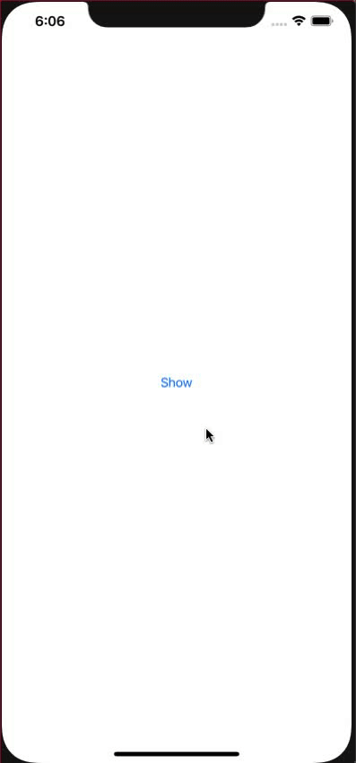

# ASProgress

[](https://travis-ci.org/amitpstu1@gmail.com/ASProgress)
[](https://cocoapods.org/pods/ASProgress)
[](https://cocoapods.org/pods/ASProgress)
[](https://cocoapods.org/pods/ASProgress)

Screenshots
---------


## Example

To run the example project, clone the repo, and run `pod install` from the Example directory first.

## Requirements
```
// Show
ASProgress.show()

// Dismiss
ASProgress.dismiss()
```

## Installation

ASProgress is available through [CocoaPods](https://cocoapods.org). To install
it, simply add the following line to your Podfile:

```ruby
pod 'ASProgress'
```

## Author

amitpstu1@gmail.com, amitpstu1@gmail.com

## License

ASProgress is available under the MIT license. See the LICENSE file for more info.
